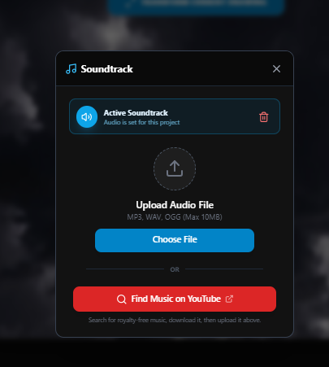

# AniMate 🎨✨

**AniMate** is a professional-grade, browser-based 2D character animation studio that bridges the gap between traditional frame-by-frame artistry and modern Generative AI. Built with a stunning glassmorphism aesthetic and a high-performance rendering engine, AniMate empowers creators to bring their stories to life with ease.

## 🎬 AniMate in Action

<div align="center">
  
  <p><em>Experience seamless frame-by-frame animation with real-time playback and AI assistance.</em></p>
</div>
<div align="center">
  
  <p><em>Experience seamless frame-by-frame animation with real-time playback and AI assistance.</em></p>
</div>

<div align="center">
  
  <p><em>Experience seamless frame-by-frame animation with real-time playback and AI assistance.</em></p>
</div>


## 📸 Visual Showcase

<div align="center">
  
  <p><em>The intuitive glassmorphism workspace with multi-layered canvas and timeline.</em></p>
</div>

<div align="center">
  <div style="display: flex; justify-content: center; gap: 20px;">
    
    
  </div>
  <div align="center">
  
</div>
  <p>
    <span><b>AI Character Builder:</b> Generate reference sheets instantly.</span> &nbsp; | &nbsp; 
    <span><b>FX Engine:</b> Apply professional filters and shakes.</span>
  </p>
</div>

## 🌟 Overview

The primary hurdle for many aspiring animators is the "blank canvas syndrome." AniMate solves this by integrating the **Google Gemini API** directly into the creative workflow. With the **AI Character Builder**, users can translate complex textual descriptions into clean, vector-style reference sheets, allowing them to focus on motion and storytelling rather than initial character design.

## ✨ Key Features

### 🧠 AI-Assisted Creation
- **AI Character Builder:** Generate unique 2D character reference sheets from text prompts using Gemini.
- **In-App Integration:** Import AI-generated characters directly into your current animation frame for tracing or reference.

### 🎞️ Animation Engine
- **Pro Timeline:** A high-precision timeline supporting frame duplication, deletion, and drag-and-drop reordering.
- **Onion Skinning:** Advanced visualization of previous (Red) and next (Green) frames to assist in smooth "in-betweening."
- **Real-time Playback:** Variable FPS controls (1-60 FPS) with instant previewing.

### 🎨 Creative Tools
- **Versatile Toolbox:** Includes Pen, Eraser, Move/Transform, and Text tools.
- **Transform Controls:** Scale, rotate, and reposition layers with a dedicated transformation HUD.
- **Glassmorphism UI:** A sleek, responsive interface designed to maximize creative focus.

### 🎬 Dynamic Effects & Export
- **Pixel FX Engine:** Apply timeline-aware effects like **Camera Shake**, **Bounce Animation**, and **RGB Glitch**.
- **Batch Processing:** Apply filters (Grayscale, Sepia, Blur, etc.) to a single frame or the entire animation at once.
- **Production Export:** Render your masterpiece to high-quality **WebM video** files directly in the browser.
- **Audio Sync:** Upload and synchronize soundtracks with your animation loops.

## 🛠️ Technical Stack

- **Framework:** [React 19](https://react.dev/)
- **Styling:** [Tailwind CSS](https://tailwindcss.com/)
- **Icons:** [Lucide React](https://lucide.dev/)
- **AI Integration:** [@google/genai](https://www.npmjs.com/package/@google/genai)
- **Rendering:** HTML5 Canvas API & MediaRecorder API

## 🚀 Getting Started

### Prerequisites

You will need a Google Gemini API Key. You can obtain one from the [Google AI Studio](https://aistudio.google.com/).

### Installation

1. Clone the repository:
   ```bash
   git clone https://github.com/your-username/animate.git
   cd animate
   ```

2. Install dependencies:
   ```bash
   npm install
   ```

3. Create a `.env` file in the root directory and add your API key:
   ```env
   API_KEY=your_gemini_api_key_here
   ```

4. Start the development server:
   ```bash
   npm run dev
   ```

## 📂 Project Structure

- `assets/screenshots/`: Visual assets for documentation.
- `assets/demo/`: Animated GIFs showcasing features.
- `src/components/`: Modular React components.
- `src/services/`: Integration with Gemini API.

## 📝 License

This project is licensed under the MIT License - see the LICENSE file for details.

---
*Made with ❤️ by Moneeba Developer*
