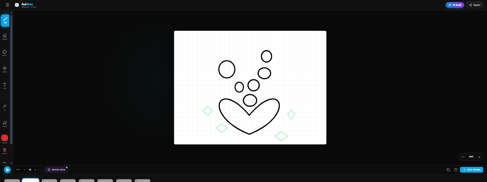

# AniMate 🎨✨

**AniMate** is a professional-grade, browser-based 2D character animation studio that bridges the gap between traditional frame-by-frame artistry and modern Generative AI. Built with a stunning glassmorphism aesthetic and a high-performance rendering engine, AniMate empowers creators to bring their stories to life with ease.

## 🎬 AniMate in Action

<div align="center">
  
  <p><em>Experience seamless frame-by-frame animation with real-time playback and AI assistance.</em></p>
</div>

## 📸 Visual Showcase

<div align="center">
  
  <p><b>The intuitive glassmorphism workspace with multi-layered canvas and timeline.</b></p>
</div>

<div align="center">
  <table style="border: none; border-collapse: collapse;">
    <tr>
      <td style="padding: 10px; border: none;">
        
        <br><b>AI Character Builder</b>
      </td>
      <td style="padding: 10px; border: none;">
        
        <br><b>Pixel FX Engine</b>
      </td>
    </tr>
  </table>
</div>

## 🌟 Overview

The primary hurdle for many aspiring animators is the "blank canvas syndrome." AniMate solves this by integrating the **Google Gemini API** directly into the creative workflow. With the **AI Character Builder**, users can translate complex textual descriptions into clean, vector-style reference sheets, allowing them to focus on motion and storytelling.

## ✨ Key Features

### 🧠 AI-Assisted Creation
- **AI Character Builder:** Generate unique 2D character reference sheets from text prompts using Gemini.
- **In-App Integration:** Import AI-generated characters directly into your current animation frame.

### 🎞️ Animation Engine
- **Pro Timeline:** High-precision timeline with duplication, deletion, and drag-and-drop reordering.
- **Onion Skinning:** Advanced visualization of previous (Red) and next (Green) frames for smooth in-betweening.
- **Real-time Playback:** Variable FPS controls (1-60 FPS) with instant previewing.

### 🎨 Creative Tools & Effects
- **Versatile Toolbox:** Pen, Eraser, Move/Transform, and Text tools.
- **Pixel FX Engine:** Apply timeline-aware effects like **Camera Shake**, **Bounce**, and **RGB Glitch**.
- **Production Export:** Render your masterpiece to high-quality **WebM video** files.
- **Audio Sync:** Upload and synchronize soundtracks with your animation.

## 🛠️ Technical Stack

- **Framework:** React 19 (Modern Hooks & Context)
- **Styling:** Tailwind CSS (Custom Glassmorphism UI)
- **AI Integration:** @google/genai (Gemini 2.5 Flash)
- **Rendering:** HTML5 Canvas API & MediaRecorder API

## 🚀 Getting Started

1.  **Obtain API Key:** Get your key from [Google AI Studio](https://aistudio.google.com/).
2.  **Clone & Install:**
    ```bash
    git clone https://github.com/your-username/animate.git
    cd animate
    npm install
    ```
3.  **Environment Setup:** Add `API_KEY=your_key` to your `.env` file.
4.  **Launch:** `npm run dev`

## 📂 Project Structure

*   `assets/`: Screenshots and Demo GIFs.
*   `src/components/`: Modular UI components (Canvas, Timeline, Modals).
*   `src/services/`: Gemini API integration logic.
*   `src/types.ts`: TypeScript interfaces for project state.

## 📝 License

This project is licensed under the MIT License.

---
*Made with ❤️ by Moneeba Developer*